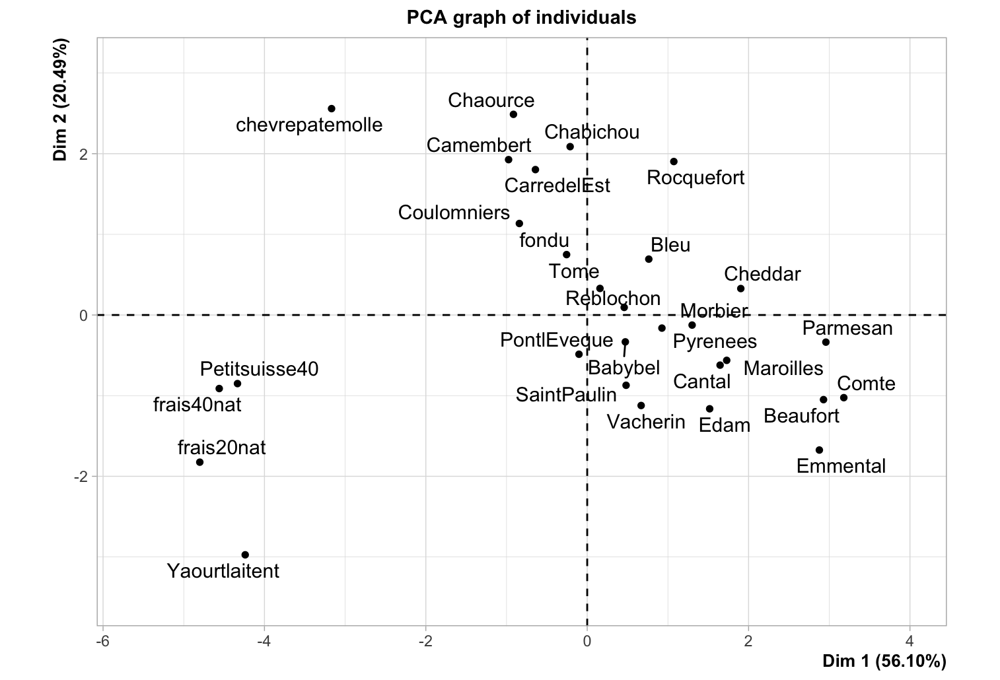
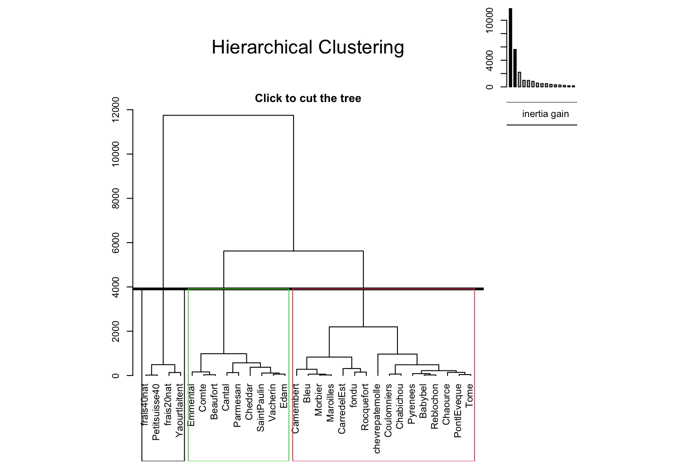
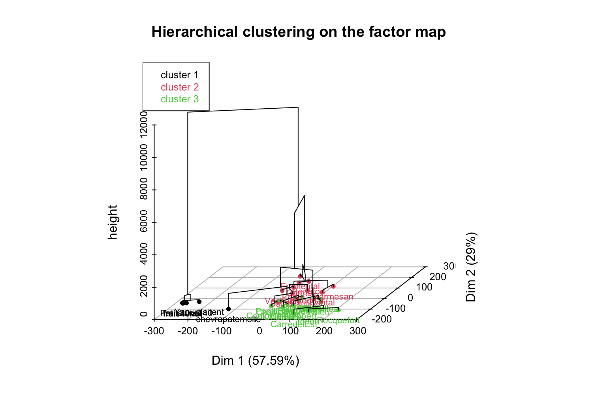
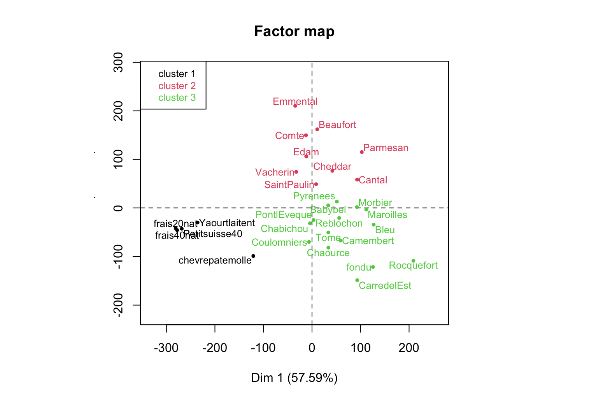

# Compte Rendu Business Decision

Le but de ce TP est d'utiliser plusieurs méthodes d'analyses de données.
Pour chaque technique d’analyse, nous devons choisir un ou plusieurs exemples adaptés, définir les objectifs, définir une démarche d’analyse et présenter l’ensemble des outils permettant d’expliquer et quantifier les résultats (ex : corrélations, contributions…)

## ACP : étude d’un tableau individus-caractères quantitatifs

On charge le dataset `fromages.csv` qui contient des données conercernant un certain nombre de fromages, notamment leur données nutritionnelles : 

```R
data<-read.csv2(file.choose(), row.names=1, sep=";") 
head(data)
```

```
            calories sodium calcium lipides retinol folates proteines cholesterol magnesium
CarredelEst      314  353.5    72.6    26.3    51.6    30.3      21.0          70        20
Babybel          314  238.0   209.8    25.1    63.7     6.4      22.6          70        27
Beaufort         401  112.0   259.4    33.3    54.9     1.2      26.6         120        41
Bleu             342  336.0   211.1    28.9    37.1    27.5      20.2          90        27
Camembert        264  314.0   215.9    19.5   103.0    36.4      23.4          60        20
Cantal           367  256.0   264.0    28.8    48.8     5.7      23.0          90        30
```

Et on calcul la matrice de corrélation pour déterminer les variables fortements corrélées : 

```R
correlation <- cor(data)
corrplot(correlation, method = "circle")
```

On remarque par exemple que la variable "folates" est fortement opposée au "calcium". Selon l'eensemble des fromages annalysées, on peut donc penser qu'un fromage riche en lactose sera pauvre en folates (vitamines).


On s'en rend bien compte si on affiche le cercle de corrélation : les vecteurs folates et calcium sont opposés. Les variables "lipides", "calories", "cholesterol" et "proteines" sont fortement corrélées entre elle. Ca semvle être évident puisqu'un fromage qui a tendance à être riche en l'une de ces 4 variables est souvent considéré comme très gras.

```R
res <- PCA(data)
```


Ainsi un fromage "chevrepatemolle" est riche en vitamines car il se situe sur l'axe "folates". On en déduit donc qu'il est pauvre en calcium (en effet 72,8, valeure la plus faible pour ce caractère). Le rocquefort serait très salé, ce qui semble juste ! Les fromages très gras sont par exemple le Cheddat ou le Parmesan. Les fromages frais quant à eux sont opposées aux axes des fromages gras. Il semblent donc plus "léger" mais aussi pauvre en calcium et en vitamines.



## Classification

On continue sur le dataset "fromages" sur lequel on va appliquer la classfication avec `HCPC`.

```R
data<-read.csv2(file.choose(), row.names=1, sep=";") 
res.hcpc <- HCPC(data)
```

On botient la classification hiérarchique suivante. 3 cluster sont identifiées :



On peut aussi représenter cette classification hiérarchique sur la factor map :



Les 3 cluster regroupent nos fromages selon leurs caractéristiques. Exemple ici pour le cluster 1, les yaourt, fromages frais et chèvres pate molles sont regroupées. Ce qui semble correcte :



## Test de Khi2

On prend le dataset suivant qui représente le dégré d'alcoolisme (0 = Abstinence, 6 = tous les jours) :

```
  hommes femmes
0     39     69
1     67     94
2    272    177
3    193    191
4    298    203
5     76     26
6    152     51
```

On joue le test de khi2 : 

```R
(test <- chisq.test(data))
```

On obtient le résultat suivant. On en déduit donc qu'il y a bien une forte différence entre les hommes et les femmes concernant le degré d'alcoolisme.

```
	Pearson's Chi-squared test

data:  data
X-squared = 84.782, df = 6, p-value = 3.663e-16
```

## AFC : étude d’un tableau de contingence

Todo @Romain

### Objectif

L'objectif de la méthode AFC est que l'on va regarder les corrélations entre les lignes pour ensuite situer sur un graphique les caractéristiques qui reviennent le plus et quels sont les noms des lignes associés.

### Démarches

La première étape est de formatter les données pour avoir un tableau exploitable.
On garde les labels sur le côté pour pouvoir afficher un plot cohérent par la suite.


## Classification : étude d’un tableau individus-caractères quantitatifs

## Analyse discriminante

Todo @Romain

## Anova