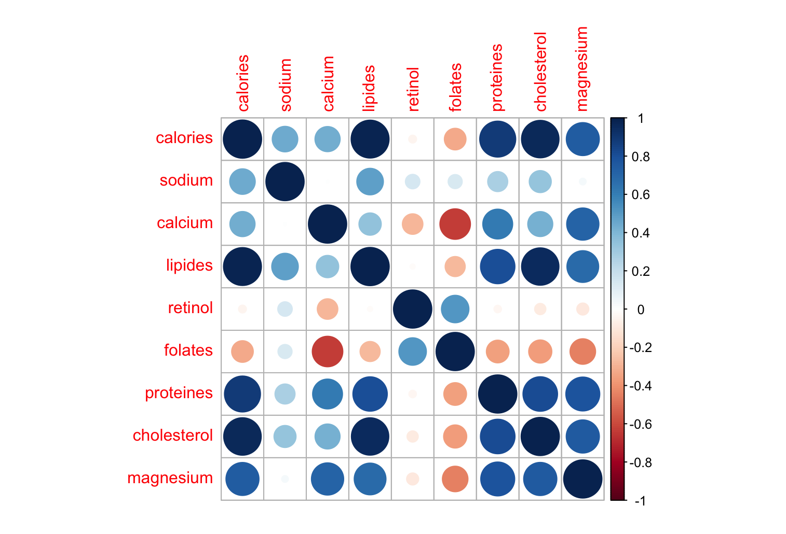
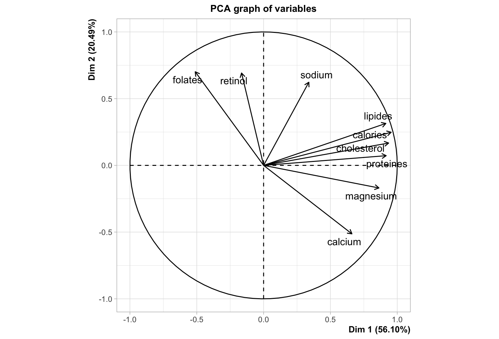

# Compte Rendu Business Decision

Le but de ce TP est d'utiliser plusieurs méthodes d'analyses de données.
Pour chaque technique d’analyse, nous devons choisir un ou plusieurs exemples adaptés, définir les objectifs, définir une démarche d’analyse et présenter l’ensemble des outils permettant d’expliquer et quantifier les résultats (ex : corrélations, contributions…)

## ACP : étude d’un tableau individus-caractères quantitatifs

On charge le dataset `fromages.csv` qui contient des données conercernant un certain nombre de fromages, notamment leur données nutritionnelles : 

```
  Fromages    calories sodium calcium lipides retinol folates proteines cholesterol magnesium
  <chr>          <dbl>  <dbl>   <dbl>   <dbl>   <dbl>   <dbl>     <dbl>       <dbl>     <dbl>
1 CarredelEst      314   354.    72.6    26.3    51.6    30.3      21            70        20
2 Babybel          314   238    210.     25.1    63.7     6.4      22.6          70        27
3 Beaufort         401   112    259.     33.3    54.9     1.2      26.6         120        41
4 Bleu             342   336    211.     28.9    37.1    27.5      20.2          90        27
5 Camembert        264   314    216.     19.5   103      36.4      23.4          60        20
6 Cantal           367   256    264      28.8    48.8     5.7      23            90        30
```

On supprime la colonne non numérique "fromages" :

```R
data <- fromages[2:10]
head(data)
```

```
# A tibble: 6 × 9
  calories sodium calcium lipides retinol folates proteines cholesterol magnesium
     <dbl>  <dbl>   <dbl>   <dbl>   <dbl>   <dbl>     <dbl>       <dbl>     <dbl>
1      314   354.    72.6    26.3    51.6    30.3      21            70        20
2      314   238    210.     25.1    63.7     6.4      22.6          70        27
3      401   112    259.     33.3    54.9     1.2      26.6         120        41
4      342   336    211.     28.9    37.1    27.5      20.2          90        27
5      264   314    216.     19.5   103      36.4      23.4          60        20
6      367   256    264      28.8    48.8     5.7      23            90        30
```

Et on calcul la matrice de corrélation pour déterminer les variables fortements corrélées : 

```R
correlation <- cor(data)
corrplot(correlation, method = "circle")
```

On remarque par exemple que la variable "folates" est fortement opposée au "calcium". Selon l'eensemble des fromages annalysées, on peut donc penser qu'un fromage riche en lactose sera pauvre en folates (vitamines).



On s'en rend bien compte si on affiche le cercle de corrélation : les vecteurs folates et calcium sont opposés. Les variables "lipides", "calories", "cholesterol" et "proteines" sont fortement corrélées entre elle. Ca semvle être évident puisqu'un fromage qui a tendance à être riche en l'une de ces 4 variables est souvent considéré comme très gras.

```R
res <- PCA(data)
```




## AFC : étude d’un tableau de contingence

### Objectif
L'objectif de la méthode AFC est que l'on va regarder les corrélations entre les lignes pour ensuite situer sur un graphique les caractéristiques qui reviennent le plus et quels sont les noms des lignes associés.

###Démarches

La première étape est de formatter les données pour avoir un tableau exploitable.
On garde les labels sur le côté pour pouvoir afficher un plot cohérent par la suite.


##Classification : étude d’un tableau individus-caractères quantitatifs

##Analyse discriminante

##Anova